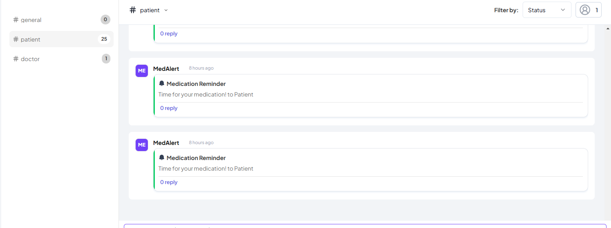

MedAlert

Overview

MedAlert is a Telex integration designed to send automated medical reminders at predefined intervals. It ensures that patients and designated recipients receive timely notifications about their medication schedules.

Features

Fetches integration specifications dynamically.

Periodically triggers reminders using Telex automation.

Customizable reminder messages and recipients.

Sends webhook notifications to external services.

Technologies Used

ASP.NET Core (C#)

JSON for configuration

Telex Integration

Webhook Service

Handle Periodic Reminder Triggers

POST /api/medalert/tick

Triggered automatically at configured intervals by Telex.

Configuration

Settings are loaded from data/integration-spec.json.

Defaults are applied if the configuration file is missing.

How It Works

Telex triggers the tick endpoint at the specified interval.

The payload settings are extracted to update the reminder message and recipients.

The reminder message is logged and sent via the webhook service.

